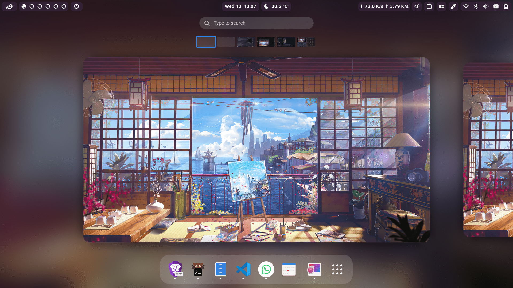

# Gnome Shell Configs

This repository contains my configurations for the Gnome desktop environment. It includes a collection of extensions and related settings that enhance the functionality and appearance of the Gnome Shell.

## Extensions

The following Gnome Shell extensions are stored in this repository:

- **AlphabeticalAppGrid @stuarthayhurst**: Restore the alphabetical ordering of the app grid.
- **asusctl-gex @asus-linux.org**: Extension for visualizing asusctl(asusd) settings and status..
- **bluetooth-quick-connect @bjarosze.gmail.com**: Allows quick and easy connection to Bluetooth devices directly from the control panel.
- **blur-my-shell @aunetx**: Adds a blur effect to various elements of the Gnome Shell, giving a sleek and modern look.
- **caffeine @patapon.info**: Prevents the system from suspending or activating the screensaver when active.
- **clipboard-indicator @tudmotu.com**: Provides a clipboard history and allows easy access to previously copied items.
- **color-picker @tuberry**: Enables picking colors from the screen and provides a color picker tool.
- **display-scale-switcher @knokelmaat.gitlab.com**: Allows quick switching between different display scaling options from control panel.
- **gnome-extension-brightness @bruno.englert.gitlab.com**: Adds brightness controls to the control panel for easy adjustment.
- **gtktitlebar @velitasali.github.io**: Removes the title bar from maximized windows, saving screen space.
- **just-perfection-desktop @just-perfection**: Customizes the desktop layout, including the taskbar, app menu, and system tray.
- **netspeed @alynx.one**: Displays network speed indicators in the top bar.
  > not upgraded for gnome 44
- **netspeed simplified @prateekmedia.extension**: Displays network speed indicators in the top bar.
  > used in gnome 44
- **openweather-extension @jenslody.de**: Provides weather information in the top bar, including current conditions and forecasts.
- **quick-settings-tweaks @qwreey**: Adds additional settings and tweaks to the Gnome Shell top bar.
- **reorder-workspaces @jer.dev**: Allows reordering of workspaces in the Activities Overview.
- **scroll-workspaces @gfxmonk.net**: Enables scrolling through workspaces using the mouse wheel or touchpad gestures.
- **supergfxctl-gex @asus-linux.org**: Adds advanced graphics settings and control for ASUS laptops.
- **top-bar-organizer @julian.gse.jsts.xyz**: Allows customization and organization of items in the top bar.
- **unite @hardpixel.eu**: Combines the title bar and top bar to save vertical screen space.
- **hanabi-extension @jeffshee**: Live wallpaper for gnome

These extensions provide additional functionality, customization options, and convenience features to enhance your Gnome Shell experience.

## Themes

It contains my custom theme along with some of my favorite themes.

- **codereaper**: this is my custom theme.
    

## Usage

To use these Gnome Shell configurations and extensions, follow these steps:

1. Clone this repository to your local machine:

   ```bash
   git clone https://github.com/your-username/gnome-shell-configs.git ~/.local/share/gnome-shell
   ```

1. Load the Gnome Shell settings and extensions:

   - Run the `settings-manager.sh` script to load and save the Gnome Shell settings and extensions configurations.
   - Alternatively, manually copy the contents of the `gnome-settings.ini` and `extensions-settings.ini` files to their respective locations in your Gnome Shell configuration directory.

1. Customize the Gnome Shell configurations according to your preferences. Feel free to modify or add extensions, update settings, or change the applied theme.
